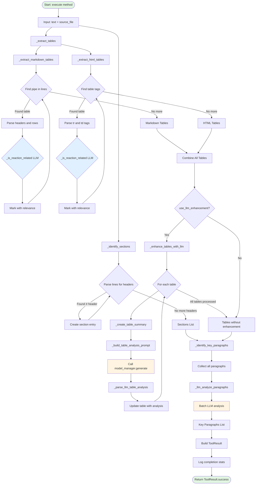
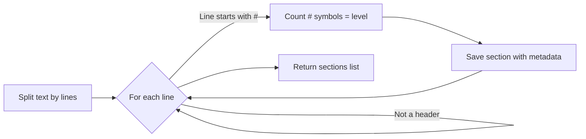
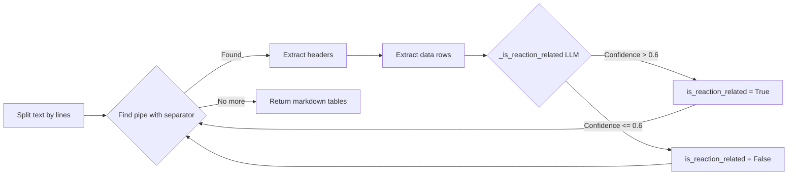
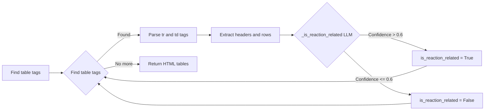
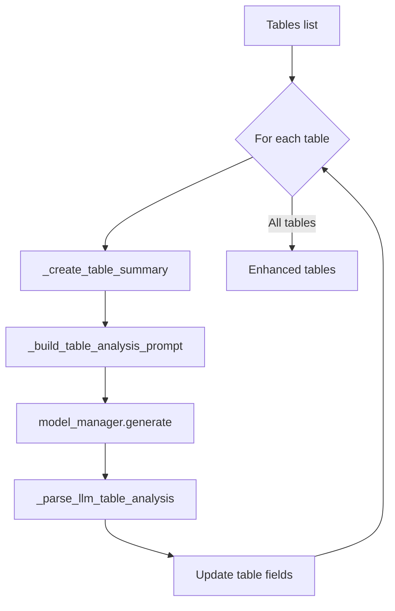
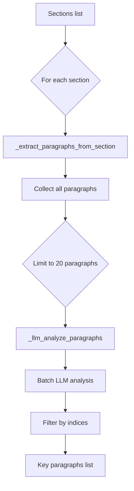

# Document Structure Analyzer Workflow

## Overview

The `DocumentStructureAnalyzer` is a tool that analyzes scientific documents to identify tables (both Markdown and HTML) and key sections containing enzyme reaction data. It uses LLM-based判断 to intelligently determine relevance and supports optional LLM enhancement for deeper analysis.

## Key Features

- **Dual Table Format Support**: Extracts both Markdown tables (`|---` separator) and HTML tables (`<table>` tags)
- **LLM-Based Relevance Detection**: Uses LLM with confidence scoring (>0.6) to identify reaction-related content
- **Batch Paragraph Analysis**: Efficiently processes multiple paragraphs in single LLM calls
- **Optional Enhancement**: Can perform deeper LLM analysis on extracted tables

## Workflow Diagram



## Detailed Process Flow

### 1. Section Identification (`_identify_sections`)



**Output**: List of sections with line numbers, levels, titles, and content

### 2. Markdown Table Extraction (`_extract_markdown_tables`)



**Key Detection Rule**: LLM analyzes table content with confidence scoring. Only tables with confidence > 0.6 are marked as reaction-related.

### 3. HTML Table Extraction (`_extract_html_tables`)



**Why HTML Tables?**: Scientific papers converted from PDF often retain HTML table formatting. HTML tables preserve complex structures like merged cells and nested formatting that Markdown cannot represent.

**Regex Patterns**:
- `<table>(.*?)</table>` - Extract table content
- `<tr>(.*?)</tr>` - Extract table rows
- `<td[^>]*>(.*?)</td>` - Extract table cells

### 4. LLM Enhancement (`_enhance_tables_with_llm`) - Optional



**LLM Analysis Prompt**:
- Analyze table structure and content
- Determine if reaction-related
- Provide confidence score
- Extract data types (kcat, KM, Tm, etc.)
- Estimate enzyme variant count

### 5. Key Paragraphs Identification (`_identify_key_paragraphs`)



**Batch Processing**: Analyzes up to 20 paragraphs in a single LLM call for efficiency. Each paragraph is truncated to 500 characters.

**LLM Prompt Focus**:
- Kinetic parameters (kcat, KM, Vmax, kcat/KM, Tm)
- Enzyme variants or mutants and their properties
- Experimental conditions (temperature, pH, buffer)
- Catalytic efficiency or activity measurements
- Substrate or product information

## Output Schema

```json
{
  "source_file": "string",
  "sections": [
    {
      "line_number": 0,
      "level": 1,
      "title": "string",
      "start_line": 0,
      "end_line": 0,
      "content": "string"
    }
  ],
  "tables": [
    {
      "table_number": 1,
      "start_line": 0,
      "end_line": 0,
      "type": "markdown|html",
      "headers": ["string"],
      "row_count": 0,
      "rows": [["cells"]],
      "full_content": "string",
      "is_reaction_related": true,
      "llm_analysis": {
        "is_reaction_related": true,
        "description": "string",
        "confidence": 0.8,
        "data_types": ["kcat", "KM"],
        "enzyme_count": "string"
      },
      "description": ["string"],
      "confidence": 0.8
    }
  ],
  "key_paragraphs": [
    {
      "section": "string",
      "section_level": 1,
      "start_line": 0,
      "line_count": 0,
      "content": "string"
    }
  ],
  "total_tables": 0,
  "total_key_paragraphs": 0,
  "llm_enhanced": true
}
```

## Key Constants

- **Document Limits**: `DocumentLimits.MIN_PIPE_COUNT`, `MARKDOWN_PREVIEW_ROWS`, `HTML_PREVIEW_ROWS`, `KEY_PARAGRAPHS_LIMIT`
- **Timeouts**: `Timeouts.DOCUMENT_ANALYSIS`
- **HTML Table Patterns**:
  - `_HTML_TABLE_PATTERN = r'<table>(.*?)</table>'`
  - `_HTML_ROW_PATTERN = r'<tr>(.*?)</tr>'`
  - `_HTML_CELL_PATTERN = r'<td[^>]*>(.*?)</td>'`
- **JSON Pattern**: `_JSON_PATTERN` for extracting JSON from LLM responses
- **Confidence Threshold**: 0.6 for reaction-related detection, 0.7 for overriding in enhancement

## Usage Example

```python
from src.tools.document_structure_analyzer import DocumentStructureAnalyzer

# Initialize with LLM enhancement
analyzer = DocumentStructureAnalyzer(
    model_manager=model_manager,
    use_llm_enhancement=True
)

# Analyze document
result = await analyzer.execute(
    text=document_text,
    source_file="data/paper.md"
)

if result.status.value == "success":
    analysis = result.data
    print(f"Found {analysis['total_tables']} tables")
    print(f"Found {analysis['total_key_paragraphs']} key paragraphs")
```

## Helper Functions

### `get_relevant_content_for_extraction(analysis)`

Extracts and combines relevant content for the LLM extraction phase:
- All reaction-related tables (full content, no row limits)
- Key paragraphs (limited by `KEY_PARAGRAPHS_LIMIT`)

### `save_document_analysis(analysis, output_dir)`

Saves the analysis to a JSON file for debugging and auditing.

## Performance Considerations

1. **LLM Calls Per Table**: Each table (Markdown or HTML) requires one LLM call for relevance判断
   - Text is truncated to 2000 characters for efficiency
   - Confidence scoring (>0.6) reduces false positives

2. **Optional Enhancement**: Adds additional LLM call per table
   - Provides deeper analysis with data type extraction
   - Use only when needed for complex documents
   - Each enhancement uses ~200-500 tokens

3. **Batch Paragraph Processing**: Up to 20 paragraphs analyzed in single LLM call
   - Significantly more efficient than per-paragraph processing
   - Each paragraph truncated to 500 characters

4. **HTML Table Overhead**: HTML tables require regex parsing before LLM analysis
   - Scientific papers often have 3-10 HTML tables
   - Regex extraction is fast and memory-efficient

5. **Sequential Processing**: Tables and paragraphs processed sequentially
   - Could be parallelized for large documents in future
   - Current implementation prioritizes accuracy over speed

## Error Handling

- **LLM Failures**: Errors are logged and re-raised to fail fast
  - No silent fallback to keyword matching
  - Requires `model_manager` for all LLM operations
- **Invalid HTML Tables**: Skipped during extraction, logged if parsing fails
- **Missing Sections**: Handled gracefully with empty section list
- **JSON Parsing Failures**: Logged as warnings, treated as non-relevant
